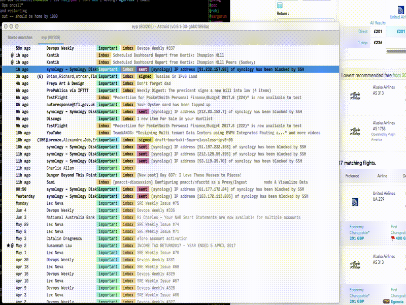

# sublime-notmuch-address #

This ST3 plugin uses `notmuch address` to find the email address you want to insert. Useful when editing externally in ST3 with [astroidmail](https://astroidmail.github.io/)

## Usage ##

We take the query from the prompt at the bottom of your window and then pass that to `notmuch`, and also filter the results with the same string. This means if you were emailing "Charlie", you would match on any email or Real Name with "Charlie" in the From/To/Cc/Bcc from your notmuch corpus.

It filters (with `grep`) because otherwise it will return up to thousands of recepients when you probably wanted something that actually matched your query.

A GIF might explain better. Here is astroidmail forwarding a mail.

